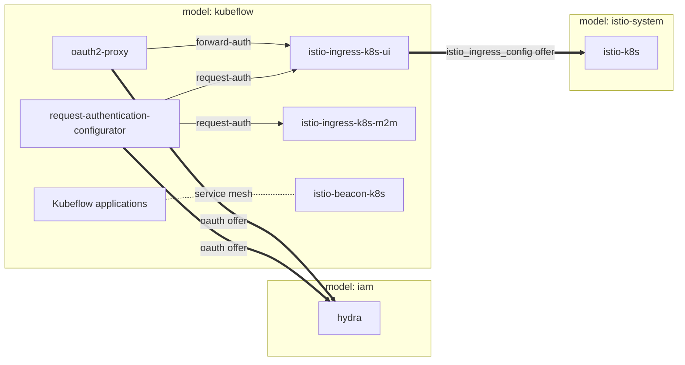

# kubeflow-ambient-iam deployment

End-to-end deployment that composes Charmed Kubeflow on the **Istio ambient**
service mesh with the **Canonical Identity Platform** (IAM), wiring everything
together across three Juju models in a single Terraform root:

| Model          | Contents                                                                                   |
| -------------- | ------------------------------------------------------------------------------------------ |
| `istio-system` | The Istio control plane (`istio-k8s`). Offers `istio-ingress-config` cross-model.           |
| `iam`          | Hydra / Kratos / Login UI (`products/iam`). Offers Hydra `oauth` cross-model.                |
| `kubeflow`     | Kubeflow apps + the two ambient gateways (`-ui` / `-m2m`) + beacon + the IAM auth charms.   |

## Architecture

The deployment always uses `service_mesh_type = "ambient"` and `auth_type = "iam"`.
The legacy sidecar + Dex/OIDC path is not used here.

## Cross-model wiring

- `istio-k8s:istio-ingress-config` is offered from `istio-system` and consumed by
  the UI gateway in `kubeflow` (`istio_ingress_config_offer_url`). The M2M gateway
  is JWT-only and is intentionally not wired to it.
- `hydra:oauth` is offered from `iam` and consumed by `oauth2-proxy` and
  `request-authentication-configurator` in `kubeflow` (`oauth_offer_url`).

## Notes

- The `iam` product uses a **vendored, patched** copy of
  `iam-bundle-integration` (see
  `terraform-refactoring/vendor/iam-bundle-integration/`) so the Identity
  Platform can compose in the same Terraform root as the rest of the deployment
  on the Juju provider `1.x`.
- Spark integration is not part of this deployment.

<!-- BEGIN_TF_DOCS -->
## Requirements

| Name | Version |
| ---- | ------- |
|  [terraform](#requirement\_terraform) | >= 1.6 |
|  [juju](#requirement\_juju) | >= 1.1.1 |

## Providers

| Name | Version |
| ---- | ------- |
|  [juju](#provider\_juju) | >= 1.1.1 |

## Modules

| Name | Source | Version |
| ---- | ------ | ------- |
|  [iam](#module\_iam) | ../../products/iam | n/a |
|  [istio\_k8s](#module\_istio\_k8s) | git::https://github.com/canonical/istio-k8s-operator//terraform | df6c85dea5decdd014fd187404163ef2d73263da |
|  [kubeflow](#module\_kubeflow) | ../../products/kubeflow | n/a |

## Resources

| Name | Type |
| ---- | ---- |
| [juju_integration.istio_k8s_jwks_ca_cert](https://registry.terraform.io/providers/juju/juju/latest/docs/resources/integration) | resource |
| [juju_model.istio_system](https://registry.terraform.io/providers/juju/juju/latest/docs/resources/model) | resource |
| [juju_offer.istio_ingress_config](https://registry.terraform.io/providers/juju/juju/latest/docs/resources/offer) | resource |

## Inputs

| Name | Description | Type | Default | Required |
| ---- | ----------- | ---- | ------- | :------: |
|  [create\_iam\_model](#input\_create\_iam\_model) | Create the iam Juju model for the Identity Platform. | `bool` | `true` | no |
|  [create\_istio\_system\_model](#input\_create\_istio\_system\_model) | Create the istio-system Juju model for the Istio control plane (istio-k8s). | `bool` | `true` | no |
|  [create\_model](#input\_create\_model) | Create the kubeflow Juju model. | `bool` | `true` | no |
|  [dashboards\_offer](#input\_dashboards\_offer) | Offer URL for COS Grafana dashboards. | `string` | `null` | no |
|  [enable\_feast](#input\_enable\_feast) | Deploy Feast. | `bool` | `false` | no |
|  [enable\_katib](#input\_enable\_katib) | Deploy Katib. | `bool` | `true` | no |
|  [enable\_kfp](#input\_enable\_kfp) | Deploy Kubeflow Pipelines. | `bool` | `true` | no |
|  [enable\_kratos\_external\_idp\_integrator](#input\_enable\_kratos\_external\_idp\_integrator) | Deploy the Kratos External IdP Integrator (Google / Entra / etc.). | `bool` | `false` | no |
|  [enable\_kserve](#input\_enable\_kserve) | Deploy KServe. | `bool` | `true` | no |
|  [enable\_mlflow](#input\_enable\_mlflow) | Deploy MLflow. | `bool` | `false` | no |
|  [enable\_notebooks](#input\_enable\_notebooks) | Deploy Notebooks. | `bool` | `true` | no |
|  [enable\_observability](#input\_enable\_observability) | Enable observability wiring to an external COS deployment. | `bool` | `false` | no |
|  [enable\_tensorboard](#input\_enable\_tensorboard) | Deploy Tensorboard. | `bool` | `true` | no |
|  [enable\_training\_v1](#input\_enable\_training\_v1) | Deploy the v1 Training Operator. | `bool` | `true` | no |
|  [enable\_training\_v2](#input\_enable\_training\_v2) | Deploy the v2 Kubeflow Trainer. | `bool` | `false` | no |
|  [external\_auth\_hostname](#input\_external\_auth\_hostname) | External hostname for the iam Traefik ingress. | `string` | n/a | yes |
|  [external\_m2m\_hostname](#input\_external\_m2m\_hostname) | External hostname for the M2M ambient ingress gateway. | `string` | n/a | yes |
|  [external\_ui\_hostname](#input\_external\_ui\_hostname) | External hostname for the UI ambient ingress gateway. | `string` | n/a | yes |
|  [github\_profiles\_automator\_config](#input\_github\_profiles\_automator\_config) | Configuration for the github-profiles-automator charm (e.g. repository and PMR path). | `map(string)` | `{}` | no |
|  [hydra\_revision](#input\_hydra\_revision) | Revision for the Hydra application. | `number` | `null` | no |
|  [iam\_model\_name](#input\_iam\_model\_name) | Name of the iam model to create. | `string` | `"iam"` | no |
|  [iam\_model\_uuid](#input\_iam\_model\_uuid) | UUID of an existing model to deploy the Identity Platform into (required when create\_iam\_model is false). | `string` | `null` | no |
|  [istio\_ingress\_k8s\_m2m\_config](#input\_istio\_ingress\_k8s\_m2m\_config) | Configuration for the M2M ambient gateway (e.g. external\_hostname). | `map(string)` | `{}` | no |
|  [istio\_ingress\_k8s\_ui\_config](#input\_istio\_ingress\_k8s\_ui\_config) | Configuration for the UI ambient gateway (e.g. external\_hostname). | `map(string)` | `{}` | no |
|  [istio\_k8s\_channel](#input\_istio\_k8s\_channel) | Channel for the istio-k8s control plane charm. Use dev/edge: it exposes jwks-ca-cert and matches the gateways' istio-ingress-config version (2/* predates these). | `string` | `"dev/edge"` | no |
|  [istio\_k8s\_config](#input\_istio\_k8s\_config) | Configuration for the istio-k8s control plane charm. | `map(string)` | `{}` | no |
|  [istio\_k8s\_platform](#input\_istio\_k8s\_platform) | Platform value for istio-k8s (always merged into its config as 'platform', including an empty string). | `string` | `""` | no |
|  [istio\_k8s\_revision](#input\_istio\_k8s\_revision) | Revision for the istio-k8s control plane charm. | `number` | `null` | no |
|  [istio\_system\_model\_name](#input\_istio\_system\_model\_name) | Name of the istio-system model to create. | `string` | `"istio-system"` | no |
|  [istio\_system\_model\_uuid](#input\_istio\_system\_model\_uuid) | UUID of an existing model to deploy istio-k8s into (required when create\_istio\_system\_model is false). | `string` | `null` | no |
|  [kratos\_external\_idp\_integrator](#input\_kratos\_external\_idp\_integrator) | Configuration for the Kratos External IdP Integrator (passed through to the iam product). | `any` | `{}` | no |
|  [kratos\_revision](#input\_kratos\_revision) | Revision for the Kratos application. | `number` | `null` | no |
|  [kserve\_controller\_config](#input\_kserve\_controller\_config) | Configuration for the kserve-controller application (e.g. domain-name). | `map(string)` | `{}` | no |
|  [logging\_offer](#input\_logging\_offer) | Offer URL for COS Loki logging. | `string` | `null` | no |
|  [login\_ui\_revision](#input\_login\_ui\_revision) | Revision for the Identity Platform Login UI application. | `number` | `null` | no |
|  [metrics\_offer](#input\_metrics\_offer) | Offer URL for COS Prometheus remote-write. | `string` | `null` | no |
|  [model\_uuid](#input\_model\_uuid) | UUID of an existing kubeflow model (required when create\_model is false). | `string` | `null` | no |
|  [release](#input\_release) | Kubeflow release to deploy. Use 'latest' for latest tracks or '1.11' for pinned 1.11 tracks. | `string` | `"latest"` | no |
|  [risk](#input\_risk) | Charm channel risk level to deploy (stable, candidate, beta, edge). | `string` | `"edge"` | no |
|  [traefik\_config](#input\_traefik\_config) | Configuration for the iam Traefik ingress (e.g. external\_hostname). | `map(string)` | `{}` | no |

## Outputs

| Name | Description |
| ---- | ----------- |
|  [iam\_model\_uuid](#output\_iam\_model\_uuid) | UUID of the iam model hosting the Canonical Identity Platform. |
|  [istio\_ingress\_config\_offer\_url](#output\_istio\_ingress\_config\_offer\_url) | Cross-model offer URL of istio-k8s:istio-ingress-config consumed by the kubeflow gateways. |
|  [istio\_system\_model\_uuid](#output\_istio\_system\_model\_uuid) | UUID of the istio-system model hosting the Istio control plane. |
|  [oauth\_offer\_url](#output\_oauth\_offer\_url) | Cross-model offer URL of hydra:oauth consumed by the kubeflow IAM auth charms. |
<!-- END_TF_DOCS -->
